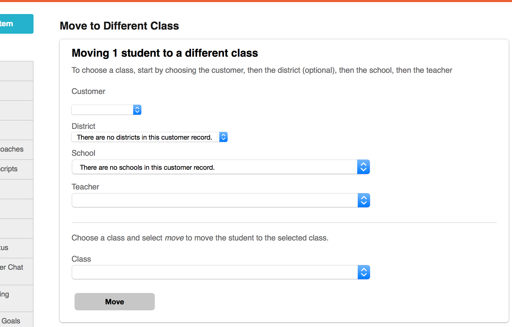
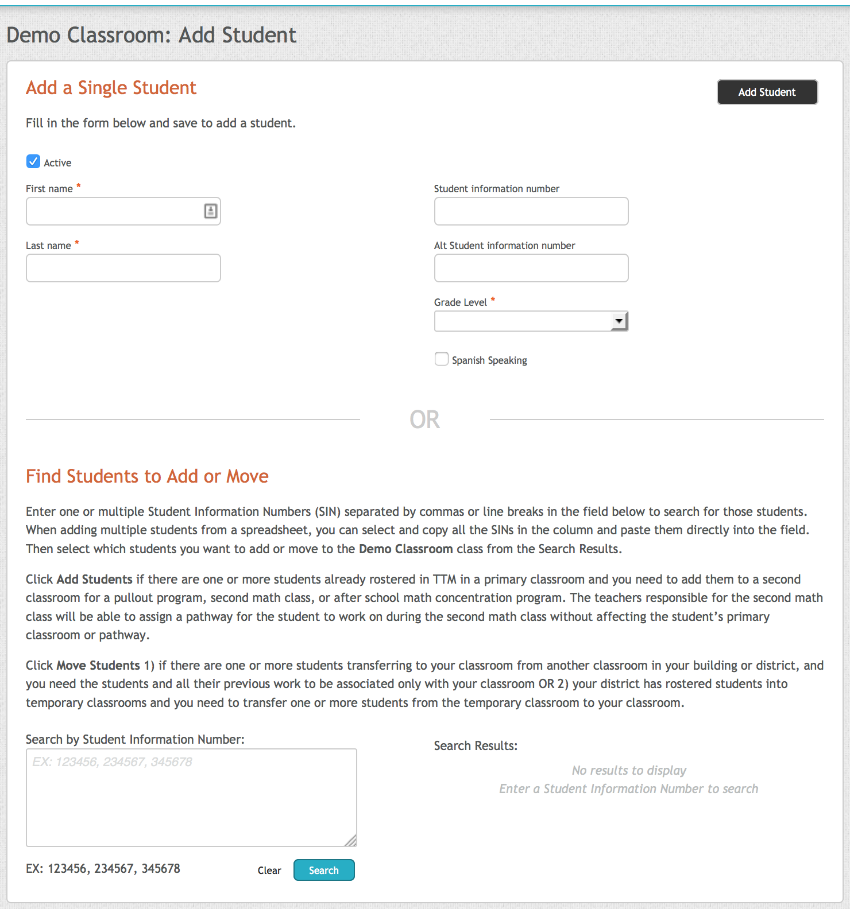
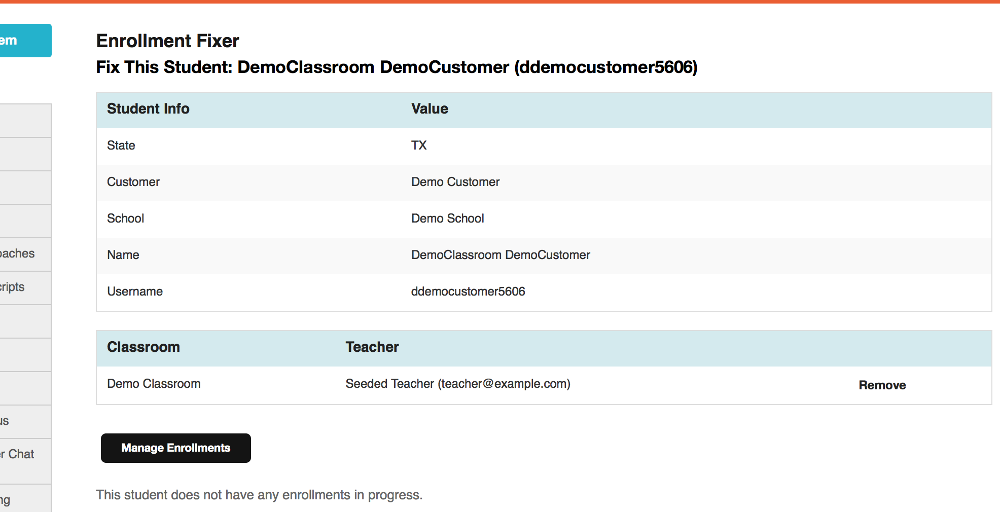
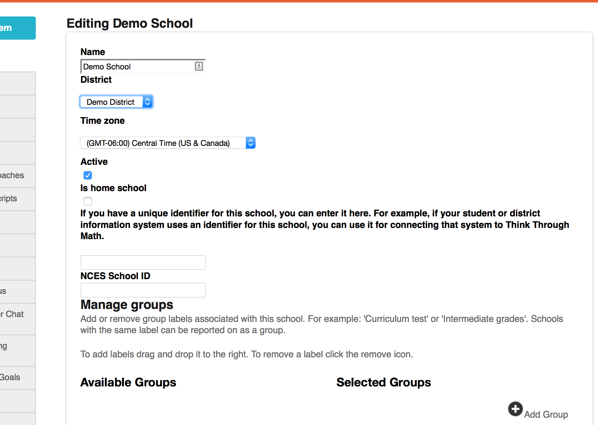
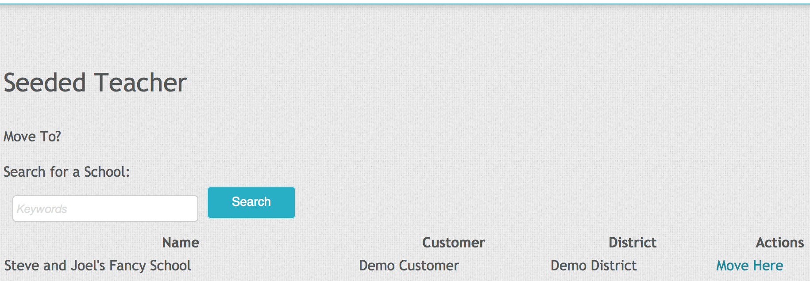

# Overview

A major requirement of the reporting definitions alignment initiative is to
handle all student movement between classrooms in a consistent manner.
Historically, movements have not been captured uniformly, and we are trying to
unify behind a common standard to improve the story presented by our reports.

To achieve this goal, it is essential that we understand all the different ways
a student can be moved throughout the system. This document is a (yet-incomplete)
effort to document all this information in one location.

# Pages

## The "Student Movement" Page



### Aliases:

 - Move on Student List
 - Move on Classroom Roster

### URL:

An example URL for this page:

```
classrooms/1/students/move?students[]=38
```

### Location:

As a super user:

1. Select "Students" from the "Manage" menu.
2. Find the row containing the student to move and click the associated "Move" link.

As admin or teacher users:

1. From the dashboard, drill down to the "Classes" list.
2. Find the row containing the class with a student or students to move and click
   the associated "Current Students" button.
3. Select the students to be moved and click the "Change Class" button.

### Behavior:

Depending on the user's role, a specified student can be moved through the system.
A super user can move a student to a new customer, district, school and classroom;
teachers can only move students between their classrooms.

---

## The "Add Students" Page



### URL:

An example URL for this page:

```
classrooms/1/students/new
```

### Location:

As an admin user:

1. Navigate to Classes list.
2. Click "Add Students"

### Behavior:

1. Under the "Find Students to Add or Move" section, enter student information
   numbers and then click "Search."
2. At this time you can either choose to add or move students which will have a
   different behavior:
   - When you click "Add"

     The logic maintains the rule that no student can belong to multiple schools.
     Any students who are being added to a school and they already belong to a
     different school, they will have to be moved instead.

     This logic is implemented in the following way:

     `let C = Classroom to add student to`

      For all students who:
        - do not belong to any classrooms or,
        - belong to a classroom in the same school as `C`,

      add the students to `C`.

      For all students who belong to a different school than `C`
      prompt the user to instead _move_ students to `C`, or do nothing.
   - When you click "Move" or are prompted to move students
     - The logic maintains that all moved students are active. As a result, any
       inactive students are activated at this time. All students are then moved.
     - Students who belong to multiple classrooms are not moved.

This page allows a user to add students to a classroom. The students to be added
can be either searched for or created.

---

## The "Enrollment Fixer" Page



### Location:

As a super user:

1. Select "Students" from the "Manage" menu.
2. Find the row containing the student to move and click the associated "Fix" link.
3. In the "Classroom" section, there is an option to "Remove" the student from classrooms.

### Behavior:

The student is removed from the associated classroom.

---

## The "Edit School" Page



### Location:

As a super user:

1. Select "Schools" from the "Manage" menu.
2. Find the row containing the school to move and click the associated "Edit" link.
3. Update the 'District" field and click the "Save" button.

### Behavior:

The school has been moved to a new district within its present customer. It cannot
be moved to a new customer.

---

## The "User Move" Page



### URL:

An example URL for this page:

```
user_moves/new?user_id=6
```

### Location:

As a customer admin (district users may also work):

1. Click the Users -> Educators link in the nav bar.
2. On this page, click the *name* of the teacher you wish to move. Do
   *not* click "Edit".
3. On this page, click the "Move To School" button.
4. On this page, click one of the "Move Here" links on the right hand
   side of the school selection table.

### Behavior:

This page allows teachers and school admins to be transferred between
schools. We used to allow an optional movement of the teacher's classroom (and students)
but this functionality has been removed.

# Clever

Clever information syncs into TTM when:

* the nightly job is run
* a district is provided a Clever ID; its data is imported immediately.
* `DISTRICT_ID=[id] rake clever:synchronize` or `TTM::Clever::Updater.process_district_events(district_id)` are run on production manually.

## Movements

Students can be moved through Clever. While other entities can be moved (especially users),
students are not moved along with these other moves. Additionally, classrooms,
schools and districts are not moved by Clever.

### Student Moves

For a given update/sync from clever:

- if a student has *both* an add and a remove event for them, it is interpreted as a move.
- Otherwise, adds and removes are performed as-is.

# Movements not supported
  - Districts, schools, and classrooms cannot be moved between customers
