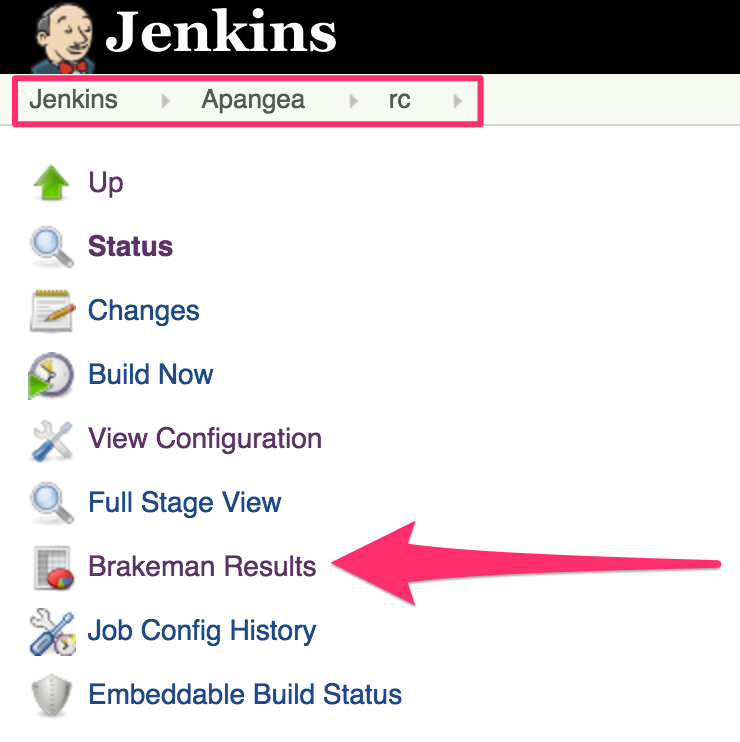
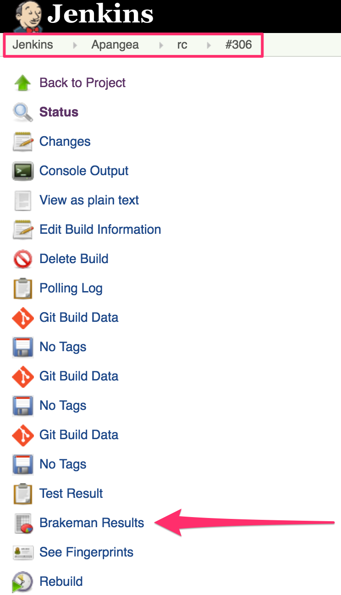

# Security Scanning with Brakeman

[Brakeman](http://brakemanscanner.org/) is an open source static vulnerability scanner for Ruby on
Rails.  We scan [Apangea](https://github.com/thinkthroughmath/apangea) with it during Apangea builds
on Jenkins.  There are two scans with each build: (1) A full scan to generate HTML and JSON reports,
and (2) a compare scan to discover new vulnerabilities introduced by code changes.

## Configurations
There are 2 configuration files used in running Brakeman:

- One is for the full scan, and is located in the Apangea repo at `config/brakeman-standard.yml`
- The other is for the compare scan, and is located in the Apangea repo at `config/brakeman-diff.yml`

In both scan configurations, output files are defined, but those output file values are [overridden
in the Jenkins build](https://github.com/thinkthroughmath/jenkins-pipeline-shared/blob/master/src/security.groovy#L14).
The output files are overridden because other parts of the Jenkins build (i.e report archiving and
publishing, the compare scan, future builds) depend on these output files having specific names.

These configuration files exist for a couple reasons:

1. So Brakeman can be run locally similar to how Jenkins runs it without needing to reference the
build tasks in the [shared Jenkins repo](https://github.com/thinkthroughmath/jenkins-pipeline-shared)
to find out what command line options to pass in.
2. So we can make changes to the Brakeman run options without needing to make changes to the build
tasks in the [shared Jenkins repo](https://github.com/thinkthroughmath/jenkins-pipeline-shared).

## Full scan of Apangea on Jenkins
Each [Apangea Jenkins build](http://jenkins.thinkthroughmath.com:8080/job/Apangea/) runs Brakeman
using the `config/brakeman-standard.yml` config file.  The purpose of this scan is to generate two
versions of the output report: one in HTML format, and the other in JSON format.

The JSON formatted report is archived to be used by later builds in the compare scan.

The HTML formatted report is published to Jenkins and available from "Brakeman Results" in the
navigation menu on the left side of the particular Apangea pipeline page,



or in the same navigation menu of the particular Apangea build page.



## Compare scan of Apangea on Jenkins
Each [Apangea Jenkins build](http://jenkins.thinkthroughmath.com:8080/job/Apangea/) also runs Brakeman
using the `config/brakeman-diff.yml` config file.  The purpose of this scan is to compare the current
run of Brakeman against the JSON formatted output of a previous build to identify if any new
vulnerabilities were introduced as a result of recent code changes.

If the current Apangea is build against the `master` branch, then the Brakeman JSON output from the
last successful Apangea build against the `master` branch is used in the compare.

If the current Apangea build is against the `rc` branch, then the Brakeman JSON output from the last
successful Apangea build against the `rc` branch is used in the compare.

If the current Apangea build is against a PR branch, then the Brakeman JSON output from the last
successful Apangea build against the `rc` branch is used in the compare.

The output of the compare scan is saved to an output file (`brakeman-diff-output.json`) that contains
two keys, `new` and `fixed`, each containing an array of vulnerabilities.  The `new` array is newly
introduced vulnerabilities, and the `fixed` array is vulnerabilities that have been fixed.  If the
`new` array contains more than 0 items, the build is failed.

A message similar to the following can be found in the Console Log of any Apangea build to inform
the user if any new vulnerabilities were found:

```
Brakeman found 0 new vulnerabilities. See brakeman-diff-output.json in this build's artifacts for details.
```

## Local scan
The Brakeman gem has been added to the Apangea Gemfile so that anyone can perform a scan locally.

To run Brakeman with `config/brakeman-standard.yml`, run the following from your Apangea directory

```
$ brakeman -c config/brakeman-standard.yml
```

The same can be done using `config/brakeman-diff.yml` to run brakeman in compare mode.  However, at
the time this was written there seems to be a bug in Brakeman (or its intended to work this way and
is poorly documented) where it won't generate the diff output file.  The workaround is to run the
following.

```
$ brakeman -c config/brakeman-diff.yml --compare brakeman-output.json -o brakeman-diff-output.json
```

_This assumes you have a prior scan output file called `brakeman-output.json`._

## Oh No! A new vulnerability has been found, what now?
You'll know a new vulnerability has been found because the Apangea Jenkins build will fail, and the
Console Output will contain the message mentioned in
[Compare scan of Apangea on Jenkins](#compare-scan-of-apangea-on-jenkins).  That message will say
the number of new vulnerabilities that have been introduced.

To confirm that a new vulnerability was in fact introduced, check the `brakemand-diff-output.json`
file in that particular build's artifacts on Jenkins.  The `new` array will contain the new
vulnerability.  You could then check the HTML version of the full scan report for that build, via
the Brakeman Results link in the left navigation menu, for a more readable version of the new
vulnerability with a link to some information on the type of vulnerability.
NOTE: Some (CMD/CTRL + F) searching may be necessary.

Once confirmed, [FIX IT! FIX IT! FIX IT!](https://www.youtube.com/watch?v=DtRNg5uSKQ0)  Or, have a
conversation with a QA, a Sys Admin, and/or a Product Manager/Owner about why we shouldn't fix it at
this time.

If we decide not to fix a new vulnerability, we can ignore the vulnerability so that the Apangea
Jenkins build stops failing because of it.

### Ignoring Warnings
To ignore a vulnerability, add that vulnerability to the `config/brakeman.ignore` file in the Apangea
repo.  The full vulnerability can be copied from the `new` array in the `brakeman-diff-output.json`
file into the `ignored_warnings` array in the ignore file.  The only key that is required for the
vulnerability to be ignored is the `fingerprint` key, but having all the information about the
vulnerability will be useful just in case Brakeman happens to generate a new fingerprint for some
weird reason, like that vulnerability changing lines (there's no evidence that this is actually a
problem...yet).

Ignored warnings can have a `note` key to put any textual information the ignorer may find useful.
The `config/brakeman.ignore` file contains a couple dummy samples for reference.

If we ignore a vulnerability, we should open a
[storyboard issue](https://github.com/thinkthroughmath/storyboard/issues) against the Tech Debt
milestone and add a reference to that issue in the `note` value in the ignore file.

Once a vulnerability is ignored, the Apangea build should no longer fail because of it.  However,
worry not, for the vulnerability has not been banished to the land of the unknown.  The full scan
report will contain a section at the bottom that contains all ignored warnings.

## Ruby or Rails CVE fix released
When a Ruby or Rails CVE is fixed, the Brakeman gem is updated to account for this CVE.  The Apangea
RC build will start failing with this CVE as a new vulnerability if we are on an affected version of
Ruby or Rails.  If this occurs, a P-High Orkin should be opened to upgrade to the version where the
CVE has been fixed.  Anyone can open this Orkin and work on it, but Anthlam is ultimately responsible
for ushering through the work.  Ideally we will expedite the upgrade to get the RC build back to a
passing state.  However, if business conditions demand it, we may want to add this CVE to the ignore
list so that we can continue to release while working on the upgrade in the background.
