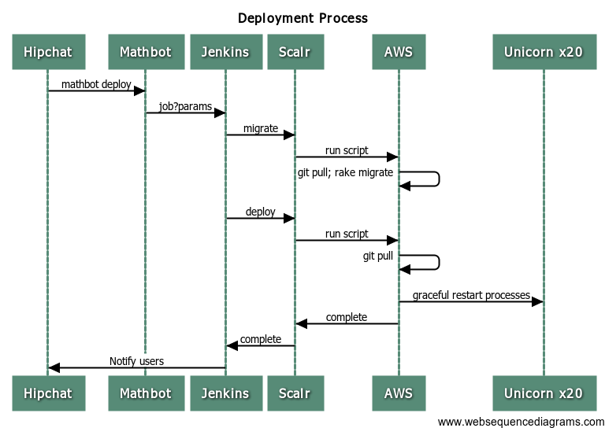

### Deployments issued through mathbot, and performed on Jenkins
Deployments can now be issued with mathbot and performed by Jenkins.  In this document I intend to detail what that means, and a little bit on how its done, but the best way to find this information, will be to follow the trail through the code.

### What Mathbot Does
Mathbot will listen for deployment commands issued from any room that it is in.  When it hears a deployment command, it will first evaluate if the user that initiated it is in the hardcoded user whitelist maintained in the mathbot repo.  If the user is not in the whitelist, they will be denied the deployment.  Otherwise mathbot will decifer which app should be deployed based on a list of application aliases.  Once it has resoved that, it will use jenkins API to trigger a build of the respected job.

### What Jenkins Does
In this section I will walk through what Jenkins does with a deployment command after it has been triggered by mathbot, or manually triggered from the Jenkins UI.

1. clones down the repo
2. pushes the `origin/master` branch to `production/master`
3. Determines if migrations need run based on if there were an file changes in this push of code in the `db/` directory, and runs them if necessary. 
4. Initiates the deployment command to scalr using the ttmscalr gem
5. Notify the deployer in Hipchat of the result of the deployment

### Sequence Diagram

### Steps to do a full system deployment through mathbot
#### I. Merge rc to master on all repos.

    mathbot promote apangea
    mathbot promote reporting
    mathbot promote lp

#### II. Issues commands to Mathbot
To deploy Apangea, reporting, AND lesson player, run the following command in hipchat

    mathbot deploy all production

For deploying any other combination of our applications, continue below

Run the following commmands in hipchat

    mathbot deploy apangea production master
    mathbot deploy reporting production master

Wait for apangea to finish depoying before starting lesson-player, because it depends on the apangea farm.  However, you can clear the lesson cache while the lesson-player is deploying, so run this next two commmands together

    mathbot deploy lp production master
    mathbot reset lesson cache production

### III. Check for manual tasks that might need done
[[Manual tasks for the next deployment]]

## SOMETING WENT WRONG!
**Stay calm!** If you can figure out and fix what went wrong, do it. If you know something is wrong, and can't fix it, then you might just want to rollback.  Jenkins saved the previous SHA for you, so you just have to force push back to that SHA. I'll walk you through that now.

### I. Find the SHA from Jenkins

1. Follow the link that Jenkins gave you to the build it just ran, it should look something like http://jenkins.thinkthroughmath.com:8080/job/Deploy-apangea/123
2. On this page you should be able to see "SHA before deployment" and then the previous SHA will be printed.  Copy it. I will refer to it in the below commands as $SHA

### II. Rollback to the previous SHA

1. Goto http://jenkins.thinkthroughmath.com:8080/view/Deployments/job/Rollback-apangea/build?delay=0sec
2. Select FARM: production , SHA: $SHA , Optionally if you want pinged in hipchat, add your mention name.
3. click Build
