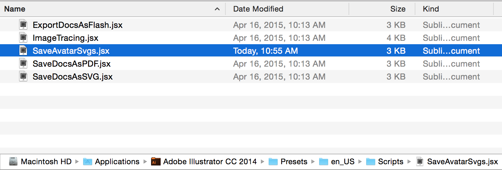
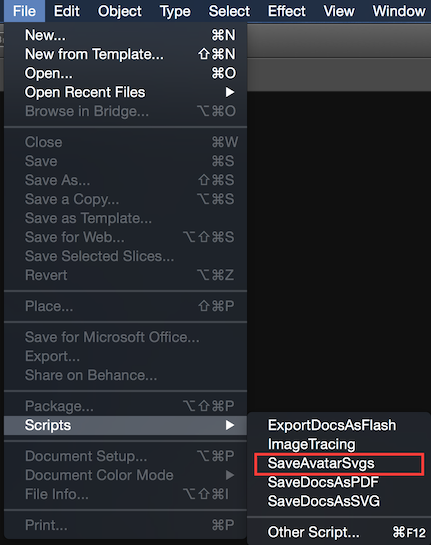
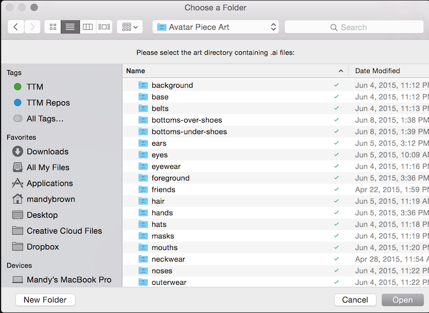
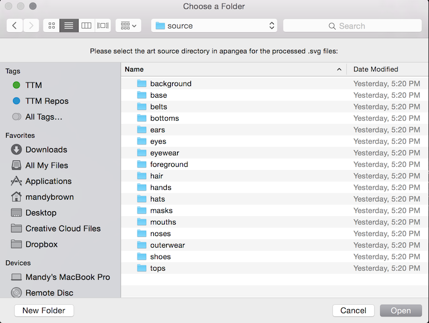

# Reviewing Avatar Art

Normally we get the art from Megan in a Trello board. We have been using [this one](https://trello.com/b/W9mmZ77C/avatar-builder-design-workflow).

When you get the art, it will be split up into separate pieces - these pieces need to move into the [Google Drive folder here](https://drive.google.com/drive/u/1/folders/0Bz6JiTiQXxg4flhXYy1vU2NnMHdLOVhuUG04cEttQ3pwV3M0TEdLb3NfWTZpRVVlQTBIMTQ). It is important that they wind up in the right category / directory since this determines which layer they show up on the avatar, so if you are unsure where something belongs, ask! Megan (& the artists) know what they should be. A couple of notes here:

- Backgrounds should be under 'extras--over-friends', items that are extras but on the avatar's body should be 'extras--under-friends'. 
- "Tight" pants should go into 'bottoms--under-shoes' (shoes will show up on top of them), but by default put bottoms under 'bottoms--over-shoes' (skirts and looser pants *definitely* need to be there). 
- Masks go under 'hats' or 'extras--under-friends'; you may need to try them out and see where they fit best.
- Full outfits go under 'outerwear'. (Like a panda suit, or spanish outfit, for instance.)

I usually open the files in illustrator and review them before putting them in the google drive, making sure they match all of our specifications, and look like they will work. I often show/hide layers and paths as an easy way to verify which parts are what, or to see how a wearing piece fits on the template. Some things to check:

- Each .ai file should have at least 3 layers named 'preview', 'wearing', and 'template' ('template' is least important). These are case sensitive!
- Some .ai files have another layer for a part of the piece that shows up behind the avatar - these should be labeled 'wearing-back' (make sure that hyphen is in there!). The preview should contain both parts (so it looks more whole).
- I like to make sure the filenames are spelled correctly, because the filename becomes the piece_id.
- Also make sure the filenames are unique, and don't match any other filenames in the google drive.
- Keep an eye on where the pieces sit, the template should give you an idea if they are in a good place or if other pieces might overlap them too much.
- For any piece that has a colorizable bit, the 'preview' and 'wearing' (and probably 'wearing-back') layers should have a path inside them called 'colorizable'. Make sure they are the same bits on the preview and the wearing versions.
- If there are any parts of the piece that should be skin colored, make sure those paths are called 'skin' (ie, face parts, hands, etc).
- Make sure all of the layers are visible before the piece is moved into the asset directory.
- If you get a background / scenery sort of piece - the scenery should be in 'wearing-back' and there should be no 'wearing' layer. (Unless there is something that is supposed to be _in front_ of the avatar.)

After the pieces are processed, they are added to apangea deactivated - I usually go in and activate *all* of the pieces locally (`AvatarPiece.update_all(active: true)`) and then, in apangea as a student, test the new ones with some other pieces to make sure they 'work' (this is a bit of a judgement call, but sometimes there are just too many weird overlaps or whatever and the piece isn't workable in the system). Make sure to give your student lots of points (`PointCorrector.new(student: student, current_points: 10000000, lifetime_points: 10000000, reason: 'testing').correct!`)!

Before processing, I usually make sure I am on a new apangea branch based off of rc, just to make certain it is easy to merge the new assets in. I make 2 commits to it -- one to add the new source files (right after running the illustrator script). The second commit is to the processed pieces after running the rake task (they get merged into big svgs - one per category).

# Avatar art processing

Once we have [finished art in correctly formatted files](https://docs.google.com/document/d/1xoPQn-cnRfl-1QjCGj6nEsIwluoh5R_i-7nP6cnbKJY/edit), we can batch process them into SVG sprites.

### Tools

- Adobe Illustrator
- Apangea and Ruby

### AI to SVG

First we have to batch process any Adobe Illustrator files into SVGs using Illustrator. Currently we're saving all of our assets in a [Google Drive folder here](https://drive.google.com/drive/u/1/folders/0Bz6JiTiQXxg4flhXYy1vU2NnMHdLOVhuUG04cEttQ3pwV3M0TEdLb3NfWTZpRVVlQTBIMTQ).

- Download the [Save Avatar Svgs ExtendScript for Adobe Illustrator](https://drive.google.com/open?id=0B1dlE886zH6jSWNSS1pEUXFLSHM&authuser=1), and place it in your `/Applications/Adobe Illustrator CC 2014/Presets/en_US/Scripts/` directory. (Exact path may be different based on your version of Illustrator.)

    
    
    >  At the bottom of SaveAvatarSvgs.jsx, you can uncomment and adjust the directories as needed under `-- For Manda's ease of use --`; if you do this, you won't have to select your source and destination directories as shown below. Instead, the file processing will begin right away when you select SaveAvatarSvgs from the File > Scripts menu.

- Launch Illustrator.
- Select **SaveAvatarSvgs** from the File > Scripts menu.

    

- Select the directory containing the source `.ai` files. This should be the top-level directory that contains each of the category subdirectories (the Google Drive folder linked above):

    

- Select the directory where you'd like the processed `.svg` files to go. This will most likely be the `/app/assets/images/avatar_pieces/source/` directory in an apangea branch:

    
      
- Wait while Illustrator opens each `.ai` file and saves it to the new location as an `.svg`

When finished you should have a folder of Avatar piece SVGs organized in category folders. Let's continue!

### Processing SVGs

- Copy source svgs to `app/assets/images/avatar_builder/source` in Apangea.
- It's a good idea to test all of the new pieces in the avatar builder and make sure they work ok with existing pieces before making them available. Sometimes we have to ask the artist for adjustments, if a piece is obscured by too many other pieces or is broken in some other way. Just try it out with some outfits and make sure there's nothing that looks crazy.
- If you want to __disable__ any source svg pieces, append `-disabled` to their filename. Eg: `queen-dress-disabled.svg` Please note that this will remove the piece from both the store and student avatars, and does not currently refund points.
- Run `rake avatar_builder:load_pieces`. This processes the individual SVGs into sprite sheets, processes the XML to our desired format, and adds references to each piece to the database.

You can now run the Avatar Builder alongside Apangea, or pull the new data into fixtures using the instructions in the Avatar Builder readme. Have fun!

